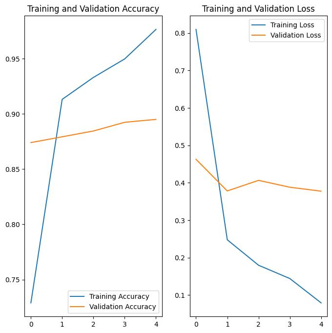

<h1 align="center">Meongku Machine Learning</h1>

## Summary
The Meongku model is used to identify 12 different cat breeds based on users' input. 

## Library
1. Numpy.
2. Matplotlib.
3. PIL.
4. TensorFlow.
5. Pathlib.
6. Os.

>>

## Load Images Data
1. Specify the data directory.
2. Load images data from the data directory using `tf.keras.utils.image_dataset_from_directory`. Split into training and validation data.

>>
>>

3. Take 20% of validation data to test data.

>>

4. Examine class names in the data.

>>

## Create The Model using Efficient Net Version 2
1. Specify the image shape.
2. Download the “efficientnet_v2” model.

>>

3. Add a batch normalization layer, dense layer, dropout layer, and output layer.

>>

4. Look at the summary of the model.

>>

5. Compile the model.

>>

6. Check loss and accuracy before training the model.
7. Fit the model with five epochs.

>>

8. Plot loss and accuracy with the epoch.

>>

## Evaluate the Model
Evaluate the model with evaluate method.

>>

## Save the model
Save the model using “model.save” based on the path that the model will be saved.

>>

## Load the model
Load the model using “tf.keras.models.load_model”, where the input is the model's path.

>>

## Tools
1. Visual Studio Code
2. Google Colab

## Source of Dataset
1. Kaggle

## Resository FastApi ML Model:
https://github.com/arisafriyanto/cat-breed-fastapi.git